# Sourcefield

Sourcefield renders animated GitHub profile diagrams, interactive browser views and managed
README project/package sections from one Rust implementation. Personal and organization profiles
share the generator while keeping their authored content, collection permissions and output separate.

<picture>
  <source media="(prefers-reduced-motion: reduce)" srcset="docs/preview/sourcefield.static.svg">
  <source media="(prefers-color-scheme: light)" srcset="docs/preview/sourcefield.light.svg">
  
</picture>

The preview uses fictional accounts and projects from the included example configuration.
The generated browser view adds navigation, filters and history; the README image is an SVG.

## Try it locally

Use Bash on macOS/Linux or Git Bash on Windows, with Git, Rustup and Python 3.11+ available.
Install the native build tools too: Xcode Command Line Tools on macOS, a C compiler/linker on Linux,
or MSVC C++ Build Tools and the Windows SDK on Windows.
Run the following from the root of a Sourcefield checkout. Rustup selects the repository's pinned
Rust toolchain; Cargo uses `Cargo.lock`. The initial tool and dependency downloads require network
access. Profile generation below is offline and needs no GitHub token.

Install the pinned WASM build tool once:

```sh
cargo install wasm-pack --version 0.15.0 --locked
```

Build the browser runtime and generate a complete synthetic profile in a new temporary directory:

```sh
bash scripts/build-wasm.sh
sourcefield_root="$PWD"
preview_root="$(mktemp -d)"
mkdir -p "$preview_root/config"
cp config/profile.toml config/offline-snapshot.json "$preview_root/config/"
cp examples/consumer-readme.md "$preview_root/README.md"

cargo run --locked -p sourcefield-cli -- generate \
  --root "$preview_root" \
  --config config/profile.toml \
  --fallback-snapshot config/offline-snapshot.json \
  --runtime "$sourcefield_root/runtime" \
  --readme README.md \
  --offline

cargo run --locked -p sourcefield-cli -- validate --root "$preview_root"
python3 scripts/validate_artifact.py --root "$preview_root" --require-wasm
printf 'Preview directory: %s\n' "$preview_root"
```

Serve the result in the same shell, then open <http://127.0.0.1:8080>:

```sh
bash scripts/serve.sh "$preview_root/docs"
```

Press Ctrl+C to stop the server. The generated `assets/` directory contains the dark, light and
reduced-motion SVGs; `docs/` contains the interactive site. The temporary directory remains available
for inspection. Edit its `config/profile.toml` and rerun generation to experiment with the content.

For a real consumer, use its checkout as `--root` and its approved configuration. Add
`--readme README.md` to update existing managed sections; organization consumers may use
`--readme profile/README.md`. Use the marker pairs in [the example README](examples/consumer-readme.md).
A normal online refresh uses `--strict-live`; replay of an existing capture uses `--offline --locked`.
The first synthetic preview uses `--offline` alone because it has no earlier capture to replay.
See [configuration](docs/configuration.md) for projects, packages and organization imports.

## Ownership

| Sourcefield | Consumer repositories |
| --- | --- |
| Model, collection, layout, rendering and browser source | Approved profile facts and presentation |
| Versioned configuration and migration tools | Canonical organization manifests |
| Native CLI and complete browser release bundle | Captured observations, imports and history |
| Generation, validation and release workflows | Generator lock, schedule and publication permissions |

Each organization owns one canonical content manifest. A personal profile explicitly imports its
selected organizations; additional organizations use the same schema and renderer. Private project
summaries enter through explicitly approved consumer content, not repository inspection.

## Distribution

Release assets cover macOS ARM64/Intel, Linux ARM64/x64 (GNU) and Windows x64 (MSVC), plus one matching
browser/WASM bundle. Consumers pin `sourcefield.lock.json` and the corresponding reusable-workflow
commit. The bootstrap verifies release integrity and build provenance before extraction or execution.
See [distribution](docs/distribution.md) for installation and the reviewed pin-update procedure.

This checkout does not imply that a remote or release has been published. Consumer workflow examples
are inert templates until an actual verified release and its commit are selected.

## Verification and maintenance

Run `bash scripts/verify.sh` for Rust checks, positive/negative tests, browser module tests and
API documentation. Browser execution and performance measurements are documented in
[verification](docs/verification.md). Read [CONTRIBUTING.md](CONTRIBUTING.md),
[ARCHITECTURE.md](ARCHITECTURE.md) and [MAINTAINING.md](MAINTAINING.md) before changing public contracts.

## Contributing and reporting

Use [bug reports and feature requests](https://github.com/kdominic89/sourcefield/issues) for public
feedback. Follow the [contribution guide](CONTRIBUTING.md) and [Code of Conduct](CODE_OF_CONDUCT.md).
See [SECURITY.md](SECURITY.md) for reporting guidance and the pending private-contact setup.
Do not post vulnerability details in public issues.
See [CHANGELOG.md](CHANGELOG.md) for unreleased changes.

Sourcefield is licensed under [MIT](LICENSE).
